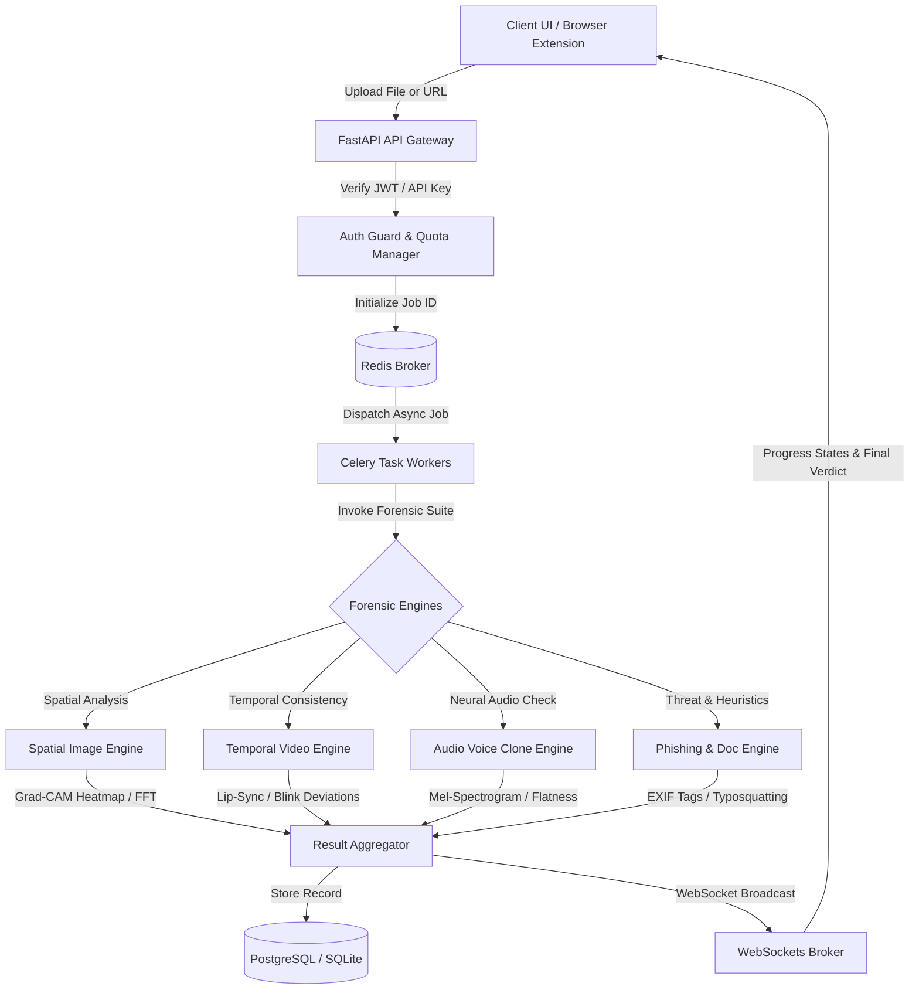

# 🛡️ DeepGuard — Deepfake & Phishing Media Verification Gateway

[](https://www.python.org/)
[](https://react.dev/)
[](https://fastapi.tiangolo.com/)
[](https://www.docker.com/)
[](https://docs.pytest.org/)
[](https://opensource.org/licenses/MIT)

DeepGuard is a production-grade, multi-modal security gateway designed to detect AI-generated deepfakes (spanning images, audio, and videos) and verify malicious phishing URLs and documents. By integrating advanced digital forensic analytics, deep-learning classifiers, real-time WebSockets, and distributed Celery workers, DeepGuard acts as a robust defense layer against media manipulation and phishing threats.

---

## 🏗️ Workspace Layout & Architecture

### Repository Directory Tree
```
├── backend/                       # Python FastAPI Backend
│   ├── alembic/                   # Database migrations (PostgreSQL/SQLite)
│   │   └── versions/              # Migration versions (e.g. 001_initial_schema.py)
│   ├── app/
│   │   ├── api/                   # REST & WS Endpoints (scan, admin, auth, webauthn, oauth)
│   │   ├── core/                  # Configuration, JWT security, logging, rate limiting
│   │   ├── db/                    # Async SQLAlchemy session mapping, models (user, audit, scan)
│   │   ├── middleware/            # Security headers, quota managers, CORS
│   │   ├── schemas/               # Pydantic validation schemas
│   │   └── services/              # AI Modality Forensic Engines (spatial, temporal, audio, phishing)
│   ├── tests/                     # Backend Pytest suite (conftest, engines, API endpoints)
│   ├── Dockerfile                 # Container setup for FastAPI service
│   ├── docker-compose.yml         # Dev cluster setup (Redis, PostgreSQL, Celery, Backend)
│   ├── main.py                    # Uvicorn/FastAPI server entrypoint
│   └── requirements.txt           # Python package dependencies
├── src/                           # React Frontend Source (Vite-bundled)
│   ├── api/                       # API clients (scanApi.js, authApi.js)
│   ├── assets/                    # Static assets & stylesheets
│   ├── components/                # Modular React Dashboard components (common, admin, workspace)
│   ├── context/                   # Global React State Context (Auth, App)
│   ├── hooks/                     # Custom React Hooks (theme, scan, keyboard shortcuts)
│   ├── pages/                     # Full-Page views (Dashboard, Workspace, Profile, Admin)
│   ├── index.css                  # Tailwinds CSS Stylesheet
│   └── main.jsx                   # Vite entry point
├── extension/                     # DeepGuard Chrome/Firefox Web Extension
│   ├── manifest.json              # Manifest V3 configuration
│   ├── background.js              # Service worker (context menus, storage syncing)
│   ├── content.js                 # Content injection script
│   ├── popup.html                 # Browser extension popup UI
│   └── popup.js                   # Popup functionality
├── docker-compose.yml             # Global orchestration docker-compose file
├── package.json                   # Vite / React package manager
├── vite.config.js                 # Vite compilation configuration
└── README.md                      # Documentation
```

### Data Flow Architecture


---

## 🔍 Forensic Detection Engines (Technical Deep Dive)

DeepGuard processes uploaded files and URLs through dedicated modality verification engines:

### 1. Spatial Image Engine (`spatial_engine.py`)
* **FFT Spectral Analysis**: Extracts the 2D Fast Fourier Transform magnitude spectrum from images. It evaluates high-frequency noise distributions to identify periodic grid anomalies left behind by Generative Adversarial Networks (GANs) and Diffusion models.
* **Haar-Cascade Face Cropping**: Uses OpenCV cascade classifiers to isolate human faces for granular analysis, avoiding background noise distortion.
* **EfficientNet-B4 Classification**: Processes the cropped regions through a deep convolutional network optimized to flag artifacts from synthetic face generators.
* **Grad-CAM Visual Explainer**: Computes gradients at the final convolutional layers to isolate regions of interest. It outputs a base64-encoded visual heatmap overlay that highlights the specific regions identified as manipulated (e.g. eyes, mouth, nose boundaries).

### 2. Audio Voice Clone Engine (`audio_engine.py`)
* **Mel-Spectrogram Extraction**: Convers raw audio waveforms (WAV/MP3/M4A) via Librosa to compute 2D Log-Mel scale spectrograms.
* **Vocoder Artifact Heuristics**:
  * **Spectral Flatness**: Identifies unnaturally flat regions in the audio spectrum, which are characteristic of neural vocoder output.
  * **Zero-Crossing Rate (ZCR)**: Analyzes localized temporal noise that frequently flags synthetic text-to-speech (TTS) architectures.
  * **MFCC Delta Analytics**: Checks the velocity and acceleration changes in Mel-Frequency Cepstral Coefficients (MFCC) to find unnaturally smooth frame transitions.
  * **Phase Coherence Check**: Detects periodic phase anomalies commonly generated by GAN-based voice generators.

### 3. Temporal Video Engine (`temporal_engine.py`)
* **Frame Sequence Extraction**: Splits videos into chronologically ordered frame buffers using OpenCV `VideoCapture`.
* **Spatial Cross-Evaluation**: Sequentially evaluates extracted frame sequences through the Spatial Image Engine to detect transient inconsistencies.
* **Eye-Blink Rate Tracker**: Monitors eye aspect ratios over time to flag anomalous patterns, such as an complete absence of blinking, which is common in older deepfake models.
* **Lip-Sync Coherence**: Correlates mouth region movement vectors with audio energy amplitudes to detect speech-motion misalignment.

### 4. Phishing & Document Engine (`phishing_engine.py` & `pdf_forensic_service.py`)
* **URL Reputation & Heuristics**:
  * **Typosquatting Detection**: Uses Levenshtein distance computations to flag lookalike domains that mimic high-value brands (e.g., `paypa1.com` instead of `paypal.com`).
  * **IP & TLD Flagging**: Identifies direct IP addresses in URLs and flags domains that use high-risk Top-Level Domains (TLDs).
* **EXIF Metadata Inspection**: Extracts metadata to verify editing history. It checks for signatures from software like Photoshop, GIMP, or Midjourney, and flags missing EXIF streams.
* **PDF Forensic Service**:
  * **Timeline Consistency**: Cross-references creation and modification timestamps in the document structure.
  * **Font Analysis**: Checks for invalid or un-embedded fonts and flags PDF timeline modifications.
  * **Active Content Inspection**: Scans the document stream for malicious triggers like embedded JavaScript (`/JavaScript`, `/JS`), OpenActions, and Launch actions.

---

## 🖥️ Live Dashboard & UI Features

The React dashboard incorporates several advanced features:

* **GeoIP Threat Map**: An interactive SVG-based map component. It establishes a real-time WebSocket connection to `/api/v1/ws/alerts` and draws animated SVG arcs connecting incoming threat origins to DeepGuard HQ.
* **Multi-Modal Split-Screen Sandbox**: Provides side-by-side workspace panels allowing users to isolate audio channels, slide between original images and Grad-CAM deepfake overlays, and synchronize video timelines.
* **Progressive Loading Skeletons**: Minimizes perceived layout shifts by displaying animated CSS loading skeletons while background scan results load.
* **Floating WebSocket Alert Hub**: A real-time notification hub that displays alerts when critical threats (e.g. `DEEPFAKE_DETECTED` or `PHISHING_DETECTED`) are detected anywhere on the platform.
* **Interactive Keyboard Shortcuts**:
  * `Ctrl + U`: Focus URL Scan input field (highlights the input with an animated cyan border).
  * `Ctrl + K`: Toggle the slide-out historical search drawer.
  * `?`: Toggle the interactive keyboard shortcuts cheat-sheet modal.
  * `Escape`: Instantly close open modals, overlays, or search sidebars.

---

## 🚀 Getting Started & Local Setup

### Option A: Bare-Metal Local Setup

#### Prerequisites
* **Python**: v3.11 or higher
* **Node.js**: v18.0 or higher
* **Redis**: Installed and running (for Celery broker)

#### 1. Backend Server & Celery Workers
Navigate to the backend directory, configure dependencies, and start the application:
```bash
# Navigate to backend directory
cd backend

# Create virtual environment
python -m venv venv

# Activate virtual environment
# Windows:
.\venv\Scripts\activate
# macOS/Linux:
source venv/bin/activate

# Install requirements
pip install -r requirements.txt

# Create environment configuration
copy .env.example .env

# Initialize database schemas and seed default credentials
python -m app.db.init_db

# Launch the FastAPI web server
uvicorn main:app --reload --port 8000
```
In a separate terminal (with virtualenv activated), start the background task worker:
```bash
# Launch Celery worker
celery -A app.core.celery_app worker --loglevel=info
```
The interactive Swagger API documentation will be available at [http://localhost:8000/docs](http://localhost:8000/docs).

#### 2. Frontend Development Setup
Run the client from the repository root:
```bash
# Install frontend dependencies
npm install

# Start Vite hot-reloading development server
npm run dev
```
Open [http://localhost:5173/](http://localhost:5173/) in your web browser.

---

### Option B: Docker Orchestration Setup

You can build and spin up the complete architecture (PostgreSQL, Redis database caching, Celery background workers, FastAPI backend gateway, and React frontend) using a single command:
```bash
# Navigate to the backend directory containing docker-compose.yml
cd backend

# Build and start the container cluster
docker-compose up --build
```

---

### Option C: Browser Extension Installation

1. Open your browser and navigate to the extensions page (e.g., `chrome://extensions` in Google Chrome).
2. Enable **Developer mode** using the toggle in the top-right corner.
3. Click **Load unpacked** and select the `/extension` folder from this repository.
4. Once loaded, you can verify links or images via the right-click context menu.

---

## 🔑 Default Seed Credentials

Upon database initialization, the backend automatically seeds the database with the following default accounts if they do not exist:

| Role | Default Email | Password | Accessible Workspace |
| :--- | :--- | :--- | :--- |
| **System Administrator** | `admin@example.com` | `AdminPass123!` (or `password`*) | Admin Operations Control Center (`/admin`) |
| **Standard User** | `user@example.com` | `UserPass123!` | User Verification Workspace (`/dashboard`) |
| **Legacy Test User** | `test@example.com` | `password`* | User Verification Workspace (`/dashboard`) |

*\*Available if database was initialized using the legacy `seed_creds.py` script.*

---

## ⚙️ Environment Configuration Reference

The backend uses the following environment variables. Set these in `backend/.env`:

| Key | Default Value | Description |
| :--- | :--- | :--- |
| `APP_NAME` | `Deepfake & Phishing Media Verification Gateway` | The application name displayed in Swagger docs and UI headers. |
| `APP_ENV` | `development` | Runtime environment mode: `development`, `staging`, or `production`. |
| `DEBUG` | `true` | Enables auto-reload and database creation schemas when true. |
| `SECRET_KEY` | `change-me-to-a-long-random-secret-key-in-production` | Secret signature key for JWT authentication hashing. |
| `DATABASE_URL` | `sqlite+aiosqlite:///./deepguard_db.sqlite` | Async connection string for SQLAlchemy engine. |
| `SYNC_DATABASE_URL` | `sqlite:///./deepguard_db.sqlite` | Synchronous database connection string (used for sync engines). |
| `REDIS_URL` | `redis://localhost:6379/0` | Cache/broker URL for Redis database key-value storage. |
| `CELERY_BROKER_URL` | `redis://localhost:6379/0` | Messaging queue connection broker for asynchronous task delivery. |
| `CELERY_RESULT_BACKEND` | `redis://localhost:6379/1` | Redis database storage index dedicated to storing Celery results. |
| `ACCESS_TOKEN_EXPIRE_MINUTES` | `60` | Lifecycle lifespan of access tokens in minutes. |
| `MAX_UPLOAD_SIZE_MB` | `100` | Maximum allowable payload size for uploaded media files. |
| `ALLOWED_MIME_TYPES` | `image/jpeg,image/png,image/webp,audio/wav,...` | List of allowed MIME types. |
| `USE_MOCK_MODELS` | `true` | Set to `false` only if PyTorch model weights are downloaded. |
| `VIRUSTOTAL_API_KEY` | `""` | Integration key for URL reputation lookups. |
| `GOOGLE_SAFE_BROWSING_KEY` | `""` | Key used to run Safe Browsing domain lookups. |
| `WEBAUTHN_RP_ID` | `localhost` | Relaying Party ID for WebAuthn passkey operations. |
| `WEBAUTHN_ORIGIN` | `http://localhost:5173` | Client origin matching the browser's current address during WebAuthn checks. |
| `CORS_ORIGINS` | `http://localhost:5173,http://localhost:3000` | Whitelisted cross-origin domains. |

---

## ⚡ API Reference & WebSocket Protocols

Below is a summary of the core API routes.

### REST Endpoints
* **Authentication**:
  * `POST /api/v1/auth/register` — Create a new user account.
  * `POST /api/v1/auth/login` — Sign in and receive JWT access/refresh tokens.
  * `POST /api/v1/auth/refresh` — Refresh expired access tokens using a valid refresh token.
* **Media Verification**:
  * `POST /api/v1/scan/file` — Upload a file (image, audio, video, or PDF) for processing.
  * `POST /api/v1/scan/url` — Scan a URL for phishing indicator metrics.
  * `POST /api/v1/scan/batch` — Upload a ZIP file containing multiple assets for parallel scan scheduling.
  * `GET /api/v1/scan/history` Paginated search history records for the current user.
* **Admin Dashboard Control**:
  * `GET /api/v1/admin/stats` — Global metrics on scanned files, threat percentages, and error rates.
  * `GET /api/v1/admin/users` — List and filter registered users.
  * `PUT /api/v1/admin/users/{user_id}/quota` — Modify a user's subscription tier and upload volume quotas.

### Real-Time WebSocket Protocols
* **WebSocket Scan Monitor**: `WS /api/v1/ws/scans/{job_id}`
  * Streams real-time processing updates for active scans (e.g., `{"status": "PROCESSING", "progress": 50}`).
* **WebSocket Admin Threat Stream**: `WS /api/v1/ws/alerts`
  * Channels live threat broadcasts (e.g., `{"severity": "critical", "message": "Threat detected: phishing-url.com"}`).

---

## 🧪 Testing & QA Suite

DeepGuard includes a pytest suite that runs unit and integration tests against local configurations:

```bash
# Navigate to the backend directory
cd backend

# Execute test suite and output test coverage report
.\venv\Scripts\pytest --cov=app tests/
```

Tests validate a range of functionality, including:
* **Engine Correctness**: FFT calculations, typosquatting evaluation distances, and WAV phase checks.
* **API Gateways**: Multi-part mock file processing, authentication guards, and validation schemas.
* **WebSockets**: Live state notifications and WebSocket broadcasts.

---

## 🤝 Contributing & License

Contributions from open-source security professionals and developers are welcome. Please refer to [CONTRIBUTING.md](file:///c:/Users/Acer/Documents/3rd/3rd%20project/DeepfakeandPhishingMediaVerificationsystem/CONTRIBUTING.md) for style guides, linting standards (`oxlint`), and merge strategies.

This project is licensed under the terms of the MIT License. See [LICENSE](file:///c:/Users/Acer/Documents/3rd/3rd%20project/DeepfakeandPhishingMediaVerificationsystem/LICENSE) for details.